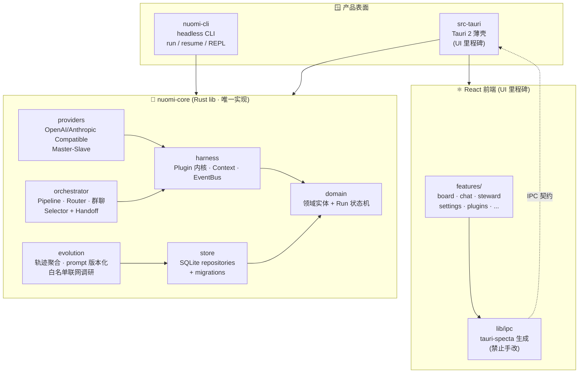

<div align="center">

# 🍡 nuomi · 糯米

### 一颗「白、软、黏」的 Agent Harness 内核

**插件化 Agent Harness 内核 + 终端验收入口** · Provider Master-Slave 编排 · Role/Team 多 Agent 协作 · Long-term Memory · Self-Evolution

```text
            ╭──────────────────────────────────────────────╮
            │              🍡  nuomi · 糯米                │
            │       "everything is a plugin."              │
            ╰──────────────────────────────────────────────╯
                          │            │            │
                     ┌────▼────┐  ┌────▼────┐  ┌────▼────┐
                     │ Provider│  │  Team   │  │Evolution│
                     │Master/Slave│ │Selector+Handoff│ │GEPA+Memory│
                     └─────────┘  └─────────┘  └─────────┘
                          │            │            │
                          └────────────┼────────────┘
                                       ▼
                              ┌────────────────┐
                              │  Rust Plugin   │
                              │    Kernel      │
                              │ (Cordis-idea)  │
                              └────────────────┘
                                       │
                          ┌────────────┼────────────┐
                          ▼            ▼            ▼
                     ┌─────────┐ ┌─────────┐ ┌─────────┐
                     │  Loop   │ │ Memory  │ │   MCP   │
                     │ Engine  │ │ + Hook  │ │stdio/HTTP│
                     └─────────┘ └─────────┘ └─────────┘
```

`Rust` · `Tauri 2` · `React 18` · `TypeScript strict` · `SQLite (WAL)` · `tokio`

</div>

---

## 📖 这是什么 / What is it

**nuomi（糯米）** 是一个**插件化 Agent Harness 内核**。

名字取自糯米——**白、软、黏**：白盒可观测、软装可插拔、黏合多 Agent 协作。它把一个 Agent Harness 该有的所有零件（Loop Engine、SystemPrompt、Memory、MCP、Hook、Command、Skills、Plugins、ReAct）都做成**插件**，跑在自研的 Rust 插件内核上（借鉴 [Cordis](https://cordis.moe/zh-CN/guide/) 理念，但不引入 Node 运行时）。

> 一句话：**一切组件皆插件 · 可观测（append-only 事件溯源）· 可编排（Pipeline/Router/群聊）· 可演进（GEPA 式反思进化 + 白名单联网学习）**。

---

## ✨ 核心特性 / Features

|  | 特性 | 说明 |
|---|---|---|
| 🧩 | **Rust 插件内核** | 统一 `Plugin` trait（注册 / 生命周期 / 事件订阅），新增组件不改内核调度代码 |
| 🎭 | **Provider Master-Slave** | OpenAICompatible / AnthropicCompatible 双协议；主 Provider 路由 + 故障降级 + 子 Provider 即工具 |
| 👥 | **Role / Team 多 Agent** | Pipeline 串行 · Router 路由 · **群聊 = Selector 选人 + Handoff 交接** · WhiteBoard 共享黑板 |
| 🧠 | **Long-term Memory** | SQLite 事件溯源 append-only；跨会话记忆检索注入上下文（向量检索后置） |
| 🧬 | **Self-Evolution** | 综合用户画像 + 记忆 + 历史轨迹迭代进化 SystemPrompt；白名单源联网调研经授权合入 |
| 🖥️ | **headless CLI** | `nuomi run "<task>"` 单发 · `nuomi resume <session>` 续传 · REPL 多轮对话 |
| 🎨 | **手绘纸质 UI** | 卡通纸质手绘线稿风格 · 4 主题（纸质亮色 / 蓝网格 / 粉笔板暗色 / 高对比）· WCAG 看护 |
| 🔌 | **第三方插件 NPP** | Python / Node 插件经 ndjson JSON-RPC 2.0 接入；工具 + 钩子 + 事件订阅三件套 |
| 🤖 | **应用管家 AI** | 应用级管家与用户元层对话；6 大能力模块 + 5 个内置研发角色（调研/设计/开发/测试/验收） |

---

## 🏗️ 架构地图 / Architecture



**边界铁律**：
1. `commands/` 只做参数校验与转发；业务逻辑一律在 `domain/` 与 `orchestrator/`
2. 前端不直接触碰文件系统 / 进程 / SQL，一切经由 IPC 契约
3. orchestrator 只依赖 trait `AgentAdapter`，不感知具体 vendor
4. **Run 状态机**：每次状态迁移必须先把 `state_changed` EventRecord 落库，再产生外部副作用

```
queued ─▶ running ⇄ awaiting_approval ─▶ succeeded
             │   │
             │   └──▶ cancelled        (user 主动)
             └──────▶ failed | timed_out
崩溃恢复: running --(orphan 心跳超时)--> interrupted ─▶ requeue
```

---

## 🚀 快速开始 / Quick Start

### 前置 / Prerequisites

| 工具 | 版本 | 用途 |
|---|---|---|
| Rust | edition 2021 (rustc ≥ 1.89) | 内核 + CLI |
| Node | ≥ 20 (pnpm) | 前端 + bindings 生成 |
| Tauri 2 CLI | 随 `pnpm` 安装 | 桌面壳（UI 里程碑） |

Linux 还需：`libwebkit2gtk-4.1-dev libgtk-3-dev libayatana-appindicator3-dev librsvg2-dev libxdo-dev libssl-dev patchelf`

### headless CLI（当前主战场）

```bash
# 一次性发任务
nuomi run "把这个模块重构成 trait"

# 续传上次会话
nuomi resume <session-id>

# 进入 REPL
nuomi
> /new       # 开新会话
> /sessions  # 列出会话
> /exit      # 退出
```

### 桌面开发模式（UI 里程碑回归时）

```bash
pnpm install
pnpm tauri dev      # 桌面开发
pnpm tauri build    # 打包
```

### 质量门 / Quality Gates

```bash
cargo fmt --all
cargo clippy --all-targets -- -D warnings    # 必须零警告
cargo test                                    # Rust 测试
pnpm typecheck && pnpm lint                   # 前端静态检查
pnpm test                                     # vitest 单测
pnpm coverage:rust                            # Rust 行覆盖率
```

> **完成 = `lint + typecheck + tests` 全绿**，汇报时附命令输出摘要。

---

## 🔌 第三方插件 / Third-party Plugin

nuomi 支持用 **Python / Node** 写插件，经 **NPP 协议**（ndjson JSON-RPC 2.0，每行一条消息）接入。一个插件可同时贡献：**工具 + 钩子 + 事件订阅 + 编辑器命令/overlay**。

```toml
# examples/plugins/upper/plugin.toml
id = "upper"
name = "Uppercase Tools"
version = "0.1.0"
api_version = 1
entry = ["python3", "plugin.py"]        # 或 ["node", "plugin.cjs"]

[permissions]
fs.read = []
fs.write = []
network = []
shell = false

[[tools]]
name = "upper"
description = "Uppercase the given text"
input = { type = "object", properties = { text = { type = "string" } }, required = ["text"] }

[[hooks]]
point = "post_tool_call"
order = 100

[[events]]
topic = "session.*"
```

```python
# examples/plugins/upper/plugin.py — 零依赖，~70 行讲完整个协议
def handle(method, params, request_id):
    if method == "initialize":
        reply(request_id, {"api_version": 1,
                            "capabilities": {"tools": True, "hooks": True, "events": True}})
    elif method == "tools/call":
        text = params.get("arguments", {}).get("text", "")
        reply(request_id, {"content": [{"type": "text", "text": text.upper()}]})
    # ... hooks / events / shutdown
```

把插件目录放进 `.nuomi/plugins/`（或设 `NUOMI_PLUGIN_PATH`）即可被宿主发现并加载。完整协议见 [`docs/plugins/`](docs/plugins/)。

---

## 🎨 手绘纸质 UI / Hand-drawn Paper UI

nuomi 的前端采用**卡通纸质手绘线稿风格**（Cartoon Paper Hand-drawn Line-art）——描边即语言、纸面即容器、抖动即性格、手写即层级。

| 主题 | 风格 | 适用 |
|---|---|---|
| 📄 `paper-light` | 牛皮纸 + 手写体 | 日间默认 |
| 📒 `grid-notebook` | 蓝网格笔记本 | 长文阅读 |
| 🪟 `chalkboard-dark` | 粉笔板暗色 | 夜间 |
| ⬛ `high-contrast` | 高对比 | 无障碍 |

- 字体自托管（Patrick Hand / Kalam / Caveat，经 `@fontsource`），离线可用
- 图标自建 ~45 枚手绘路径（24×24 viewBox，strokeWidth 1.8，`currentColor` 继承）
- 349 项测试中的 4×28 对 WCAG 配对永久看护（文本 ≥4.5:1，UI ≥3:1）

详见 [ADR 0008](docs/adr/0008-handdrawn-ui-themes.md)。

---

## 🧭 里程碑路线 / Roadmap

```text
✅ K0  workspace 脚手架 + 迁移框架
✅ K1  插件内核 (Plugin / Context / EventBus)
✅ K2  存储层 repositories
✅ K3  Provider 层 + Master-Slave 编排
✅ K4  Loop Engine (ReAct) + SystemPrompt 插件
✅ K5  Memory / Hook / MCP 插件
✅ K6  Role/Team 编排 (Pipeline · Router · 群聊) + WhiteBoard
✅ K7  headless CLI (run / resume / REPL)
✅ K8  Self-Evolution (反思进化 + 白名单联网学习)
───────────  已交付里程碑  ───────────
✅ M-CLI1   CLI Agent 接入 (adapters/cli + AgentProfile)
✅ M-TEAM1  Team 编排接入桌面壳 (team_runner + Run 生命周期)
✅ M-BOT1   Telemetry/Bot 集成 (飞书签名 webhook + 批量遥测导出)
───────────  打磨与增强阶段  ───────────
🔲 亮色主题打磨 · Monaco 体验 · 自发组队 dry-run 预览 · ...
```

---

## 📚 文档导航 / Docs

| 目录 | 内容 |
|---|---|
| [`pr.md`](pr.md) | ★ **需求权威** |
| [`AGENTS.md`](AGENTS.md) | AI 开发者最高上下文（团队 / 规则 / 工作流） |
| [`docs/specs/`](docs/specs/) | 权威 SPEC（harness-kernel-v1 · cli-agents-m1 · team-shell-m1 · steward-module · ...） |
| [`docs/adr/`](docs/adr/) | 架构决策记录（0001 Rust 插件内核 · 0008 手绘 UI · 0009 插件 sideload · 0013 IM 模型 · ...） |
| [`docs/plugins/`](docs/plugins/) | 插件开发文档（manifest / NPP 协议 / 入门教程） |
| [`examples/plugins/`](examples/plugins/) | 第三方插件示例（upper: 工具+钩子+事件） |
| [`migrations/`](migrations/) | 编号 SQL 迁移（**只增不改** append-only） |

---

## 🛠️ 技术栈 / Tech Stack（锁定）

| 层 | 选型 |
|---|---|
| Desktop 壳 | **Tauri 2**（Rust 核心 + 系统 WebView） |
| Frontend | **React 18 + TypeScript(strict) + Vite** |
| UI 状态 | **Zustand**（本地）+ **TanStack Query**（IPC 数据态） |
| Styling | **Tailwind CSS**（暗色优先，design token 化） |
| Backend 核心 | **Rust (edition 2021) + tokio** 异步运行时 |
| Persistence | **SQLite**（rusqlite + WAL，编号迁移只增不改） |
| IPC 契约 | **tauri-specta** 生成 TS bindings —— 契约单一来源 |
| 工具链 | pnpm · cargo · vitest · cargo test/clippy |

> 更换任何选型必须先写 ADR 并获得用户确认。

---

## 🧪 开发命令速查 / Commands

```bash
# ── 前端 ──
pnpm install                 # 安装依赖
pnpm tauri dev               # 桌面开发模式
pnpm tauri build             # 打包
pnpm typecheck && pnpm lint  # 前端静态检查
pnpm test                    # vitest 单测
pnpm contracts:gen           # 重新生成 IPC 绑定（改 Rust 类型后必跑）

# ── Rust ──
cargo fmt --all                              # 格式化
cargo clippy --all-targets -- -D warnings    # lint 零警告
cargo test                                   # Rust 测试
pnpm coverage:rust                           # 行覆盖率 summary
pnpm coverage:rust:html                      # HTML 覆盖率报告
```

---

## 🤝 开发团队 / AI Dev Team

nuomi 由一支 AI 开发团队协作构建（配置在 `.opencode/agent/`）：

| 成员 | 职责 | 负责区域 |
|---|---|---|
| 🎼 **conductor** | 规划拆解、派单、跨层集成、最终验收 | 全局 |
| 🎨 **ui-engineer** | React 功能实现与视觉质量 | `src/**` |
| 🦀 **core-engineer** | 领域模型、插件内核、编排引擎、存储、Evolution | `crates/nuomi-core/src/**` |
| 🌉 **bridge-engineer** | headless CLI、agent 适配器、IPC 契约 | `crates/nuomi-cli` + `src-tauri` + `src/lib/ipc` |
| 🛡️ **qa-guardian** | 评审、回归测试、质量门禁 | 测试与评审报告 |

---

## 📜 License

**MIT** — 见 [`Cargo.toml`](Cargo.toml) `workspace.package.license`。

---

<div align="center">

**🍡 先内核，后 UI · Kernel first, UI later.**

*"创建超越 MultiAgent、个人 Agent 的跨时代的 Agent项目。"*
*"UI/UX 将超越用户预期。"*
*"在 Token 消耗、缓存命中、cli 和原生 Agent 沟通协作上有创新性突破。"*
— `pr.md`

</div>
