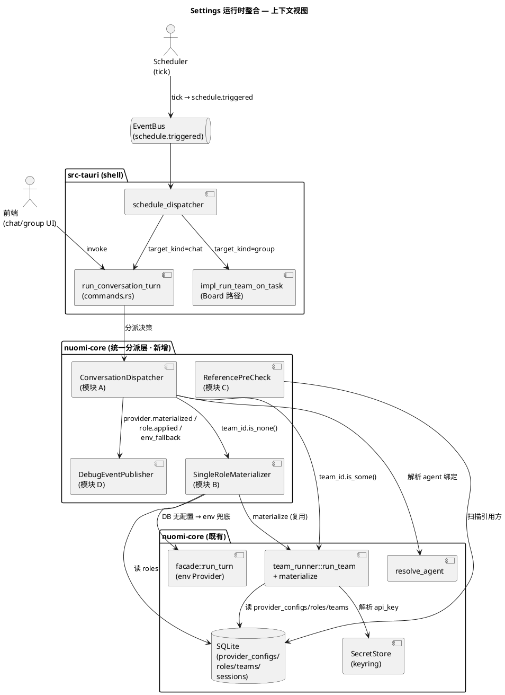
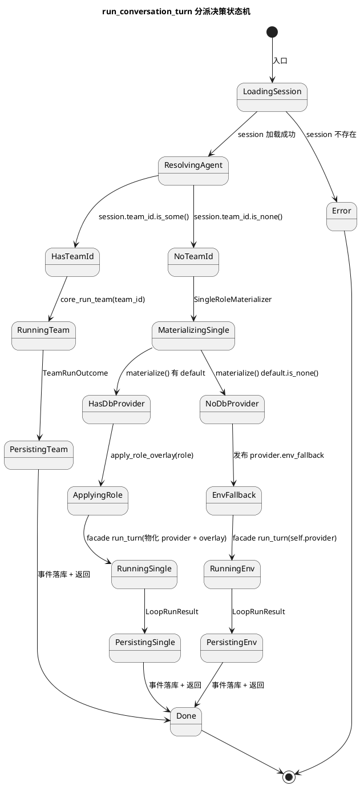
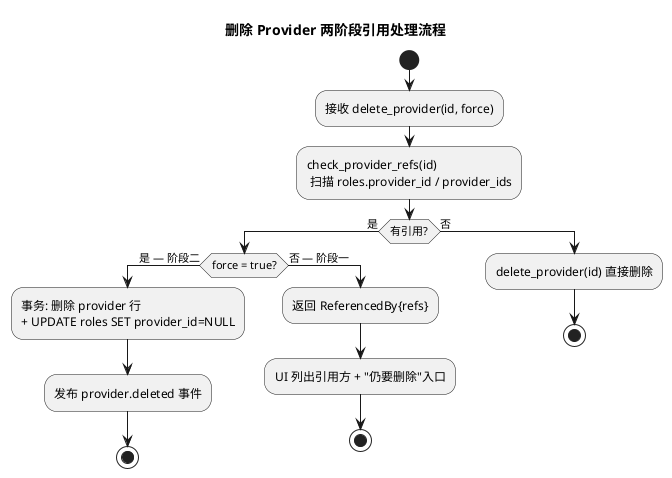
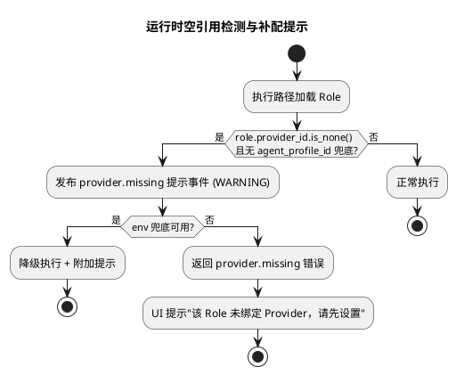
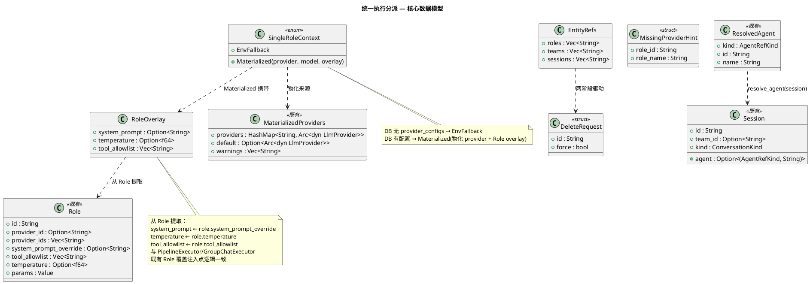

# 技术设计文档：Nuomi Settings 运行时整合（settings-integration）

> 对应需求规格：`docs/specs/settings-integration/spec.md`
> 状态：待批准（阶段一属重大架构变更，需先完成 ADR 0011 并获用户确认）
> 设计原则：**配置即执行**——Settings 中配置的 Provider/Role/Team 对所有执行路径（chat / group / board / scheduler）一致生效，消除 facade boot env 单 Provider 遗留路径导致的脱节。

---

# 一、需求与存量功能关系分析

## 1.1 需求功能与存量功能对比

### 1.1.1 已实现功能

已实现功能是指需求与存量代码完全匹配或高度相似的部分。本次整合的核心发现是：**多 Provider 真实运行时（`team_runner::materialize`）已完整实现，但仅被 Board 路径消费；其余执行路径走 facade boot 的 env 单 Provider 遗留路径，完全不读 DB 配置。**

| 需求功能 | 存量功能 | 代码位置 | 匹配度 |
|---------|---------|---------|--------|
| Board 任务走 Team 拓扑执行（读 DB Provider/Role/Team） | `impl_run_team_on_task` → `core_run_team` → `materialize` 物化 DB providers + 加载 Team/Roles + 分派 Pipeline/Router/GroupChat | `src-tauri/src/commands.rs:2474`、`crates/nuomi-core/src/services/team_runner.rs:147` | 100% |
| Provider 物化（DB `provider_configs` → 协议特定 HTTP 客户端，密钥经 SecretStore 解析，代理独立连接池，解析失败 skip+warning） | `materialize` 读 `provider_configs` + `agent_profiles`，按协议构造 `OpenAiCompatibleClient`/`AnthropicCompatibleClient`/`CliAgentClient`，master 优先选 default | `crates/nuomi-core/src/services/team_runner.rs:68` | 100% |
| Role 覆盖注入（systemPrompt / temperature / toolAllowlist 在 LLM 调用前应用） | `PipelineExecutor`/`GroupChatExecutor`/`RouterExecutor` 在构造 `ChatRequest` 时读 `role.system_prompt_override`/`role.temperature`/`role.tool_allowlist` | `crates/nuomi-core/src/orchestrator/pipeline.rs:42`、`group_chat.rs:227`、`router.rs:128` | 100% |
| 群聊拓扑（Selector + Handoff + WhiteBoard） | `GroupChatExecutor` + `LlmSelector`/`RoundRobinSelector` + `WhiteBoardService`（DB 持久化 + bus 镜像） | `crates/nuomi-core/src/orchestrator/group_chat.rs`、`selector.rs`、`whiteboard.rs` | 100% |
| `agent_profile_id` 绑定解析（Role.params.agent_profile_id 优先于 provider_id，CLI Agent 接入） | `run_team` 物化后遍历 roles，将 `params.agent_profile_id` 覆盖到 `role.provider_id`，CLI 客户端以 profile id 注册 | `crates/nuomi-core/src/services/team_runner.rs:166` | 100% |
| `agent_profile_id` 解析失败 skip + warning（不硬中断） | `materialize` 中 `CliAgentClient::new` 失败时 push warning 并 continue，收集到 `MaterializedProviders.warnings` | `crates/nuomi-core/src/services/team_runner.rs:119` | 100% |
| Scheduler group 目标自动分派到 team run | `schedule_dispatcher` 订阅 `schedule.triggered`，`target_kind=group` → `impl_run_team_on_task`（走 materialize） | `src-tauri/src/schedule_dispatcher.rs:117` | 100% |
| Session 绑定 Team 的数据模型（`team_id` 字段） | `Session.team_id: Option<String>`，`create_conversation` 接收 `team_id` 参数 | `crates/nuomi-core/src/domain/entities.rs:73`、`services/conversation_service.rs:32` | 100% |
| `resolve_agent` 解析链（Session 绑定 → 全局默认 → 首个 enabled profile → 首个 builtin role） | `resolve_agent` + `resolve_default_agent` 完整实现 | `crates/nuomi-core/src/services/conversation_service.rs:77` | 75%（解析逻辑完整，但仅用于 UI 显示，未被执行路径消费——见 1.1.2） |

### 1.1.2 需要扩展的功能

需要扩展的功能是指需求与存量代码部分匹配，需要在现有基础上改造的部分。

| 需求功能 | 存量功能 | 差异说明 | 扩展方向 |
|---------|---------|---------|---------|
| **普通对话 chat 消费 DB Provider 配置**（AC1） | `run_task_in_session` → `run_turn` 用 `self.provider`（facade boot 时从 `NuomiConfig.provider` 注入的 env 单 Provider） | facade boot 的 `NuomiKernel.provider` 来自 `ProviderSource::Endpoint`（CLI 读 `NUOMI_API_KEY`），**完全不读 `provider_configs` 表**。`run_turn` 用 `self.provider.clone()` 构造 `LoopEngine`，无物化逻辑。 | 在 `run_task_in_session` 入口增加"DB 配置探测 + 物化分派"：DB 有 Provider 配置时走 `materialize` 物化路径构造单 Role/Provider 执行上下文；DB 无配置时回退 env 兜底并发布 `provider.env_fallback` 事件。**不改 `materialize` 物化逻辑本身**，只改消费端。 |
| **普通对话 chat 消费 Role 覆盖**（AC3） | facade `run_turn` 路径无 Role 覆盖注入点；`SystemPromptPlugin` 只提供默认 prompt | `run_turn` 构造 `LoopEngine` 时不接收 Role 参数；systemPrompt 来自 `SystemPromptService` 默认值，temperature 用 `LoopConfig::default()`。Role 的 `system_prompt_override`/`temperature`/`tool_allowlist` 在此路径完全丢失。 | 在物化后、构造 `LoopEngine` 前应用 Role 覆盖：systemPrompt 拼接 override、temperature 覆盖 LoopConfig、toolAllowlist 过滤 ToolRegistry。与编排器既有 Role 覆盖机制对齐（D4），不另起一套。 |
| **`resolve_agent` 解析结果被执行路径消费**（AC5） | `resolve_agent` 仅在 `impl_list_conversations`/`impl_get_conversation` 调用，填充 `ConversationDto.agent` 供 UI 显示 | `run_conversation_turn` 不调用 `resolve_agent`，解析出的 Role/CLI 绑定对执行零影响 | `run_conversation_turn` 在分派前调用 `resolve_agent`，将解析结果（Role id 或 CLI profile id）传入执行路径，驱动 Role 覆盖与 provider 选择。 |
| **Group Conversation 绑定 Team 时走真实群聊**（AC4） | Group Conversation 升级只改 `session.kind = Group`（`add_participant` 时），执行仍走 `run_conversation_turn` → facade 单 Provider | `run_conversation_turn` 不读 `session.team_id`，绑定了 Team 的群聊会话走单 provider 对话路径（"假群聊"） | `run_conversation_turn` 增加分派：`session.team_id.is_some()` 时分派到 `core_run_team`（群聊拓扑）；`None` 时走单 Role/Provider 路径（D1 物化的 DB provider）。续传时按 team_id 有无分派，未绑定的既有会话走原路径。 |
| **Scheduler chat 目标消费 DB 配置**（AC8） | `schedule_dispatcher` 的 `target_kind=chat` → `run_task_in_session`（facade env 单 Provider） | Scheduler chat 路径与普通 chat 共享同一脱节：走 facade env Provider，不读 DB 配置 | 阶段一将 `schedule_dispatcher` 的 `target_kind=chat` 分派目标从 `run_task_in_session` 改为 `run_conversation_turn`（统一入口），Scheduler chat 自动消费 DB 配置（D1）；不改 dispatcher 订阅/触发逻辑。详见 §2.1.3 Scheduler AC8 细化设计。 |
| **Provider/Role 删除引用预校验**（AC6） | `delete_provider` 是裸 `DELETE`，注释称依赖 SQLite FK 失败 surface 引用方，但 caller 未实现引用列表返回；`delete_role`/`delete_team` 同理 | 删除被引用的 Provider 时，FK 约束可能拒绝（取决于迁移是否建 FK），但用户看不到"谁引用了它"；无级联更新或显式拒绝+列表策略，也无"引用置空 + 运行时补配提示"机制 | 在删除命令层增加**两阶段引用处理**：阶段一扫描 `roles.provider_id`/`roles.provider_ids`/`teams.member_role_ids` 引用方，有引用时**拒绝并返回引用方列表 + "仍要删除"入口**；阶段二（用户确认仍要删除后）**执行删除 + 将上层引用置为空**（`roles.provider_id = NULL` 等）；后续运行时遇到引用被置空的上层 agent（如 Role 的 provider_id 为空）时**提示用户需要设置 provider**。策略与 ADR 0011 一致（D5）。 |
| **重命名引用一致性**（AC6） | `update_provider` 改 name 列（UNIQUE 约束），Role 引用的是 Provider **id**（不变），故重命名 name 不产生悬空引用 | 若未来支持改 id（当前不支持），需级联更新引用方；当前 id 不可变，name 可变，引用关系以 id 为锚——无悬空风险 | 确认 id 不可变约束在迁移与 repo 层固化；重命名只动 name。若 ADR 选择"级联更新"策略，预留 id 变更路径（当前 no-op）。 |
| **调试事件可观测**（AC10） | `materialize` 收集 warnings 但不发布 `provider.materialized`/`role.applied` 事件；facade 路径无物化事件 | 用户无法在 Run 详情时间线确认"我配的 Role 真的生效了" | 物化阶段与 Role 覆盖注入点发布 `provider.materialized`/`role.applied`/`provider.env_fallback` 调试事件（DEBUG 级），经 EventBus → EventRecord 落库，Run 详情时间线可见。 |

### 1.1.3 需要新增的功能或接口

需要新增的功能是指需求在存量代码中完全没有对应实现的部分。

#### 模块 A：统一执行分派器（conversation dispatch）

- **功能点**：`run_conversation_turn` 内的分派决策——根据 Session 绑定（team_id / agent）选择执行后端。
- **输入**：`session_id`、`text`、Session 行（含 `team_id`、`agent`、`kind`）。
- **输出**：`RunResultDto`（统一返回结构，无论走 team 还是单 provider）。
- **核心逻辑**：`team_id.is_some()` → `core_run_team`；否则 → 单 Role/Provider 路径（物化 DB provider + Role 覆盖）。
- **依赖**：`resolve_agent`、`materialize`、`core_run_team`、facade `run_turn`（env 兜底）。

#### 模块 B：单 Role/Provider 执行上下文物化（single-role materialization）

- **功能点**：将 `resolve_agent` 解析的 Role + `materialize` 的 DB providers 组装成 facade `run_turn` 可消费的执行参数（provider、systemPrompt、temperature、toolAllowlist）。
- **输入**：`ResolvedAgent`（Role id 或 CLI profile id）、`MaterializedProviders`。
- **输出**：物化后的 provider + Role 覆盖参数；或"DB 无配置"信号（触发 env 兜底）。
- **核心逻辑**：Role id → 加载 Role → 从 `materialized.providers` 按 `role.provider_id`/`agent_profile_id` 解析 provider → 提取 override 参数。无 DB provider → 返回兜底信号。
- **依赖**：`repos::roles`、`materialize`、`resolve_agent`。

#### 模块 C：引用预校验与两阶段删除服务（reference pre-check & two-phase delete）

- **功能点**：删除 Provider/Role 前的两阶段引用处理——阶段一扫描引用方并拒绝+列表；阶段二（用户确认仍要删除后）执行删除 + 引用置空；运行时检测到空引用时提示补配。
- **输入**：阶段一：待删实体 id、实体类型；阶段二：待删实体 id + 用户确认标志（`force: true`）。
- **输出**：阶段一：`Ok(())`（无引用，可直接删）/ `Err(ReferencedBy { refs })`（有引用，返回引用方列表供 UI 展示 + "仍要删除"入口）；阶段二：`Ok(())`（删除完成 + 引用置空完成）。
- **核心逻辑**：阶段一：Provider → 查 `roles.provider_id`/`roles.provider_ids`；Role → 查 `teams.member_role_ids` + `sessions.agent`。有引用 → 返回 refs。阶段二：删除实体行 + 将引用方的外键列置为 NULL（`UPDATE roles SET provider_id = NULL WHERE provider_id = ?` 等），在单一事务内原子完成。
- **运行时补配提示**：执行路径（SingleRoleMaterializer / team_runner）遇到 `role.provider_id.is_none()` 且无 `agent_profile_id` 兜底时，发布 `provider.missing` 提示事件（WARNING 级），UI 提示"该 Role 未绑定 Provider，请先设置"——不硬中断，env 兜底可用则降级执行并附加提示，不可用则返回 `provider.missing` 错误。
- **依赖**：`repos::roles`、`repos::teams`、`repos::sessions`、`repos::providers`、`harness::EventBus`。

#### 模块 D：调试事件发布（observability events）

- **功能点**：在物化与 Role 覆盖注入点发布 DEBUG 级事件到 EventBus → EventRecord。
- **输入**：session_id、事件类型（`provider.materialized`/`role.applied`/`provider.env_fallback`）、payload。
- **输出**：EventRecord 落库（Run 详情时间线可见）。
- **核心逻辑**：复用既有 `EventBus.publish` + `repos::events::append`，DEBUG 级可关。
- **依赖**：`harness::EventBus`、`repos::events`。

## 1.2 存量功能详细分析

### 1.2.1 facade boot 执行路径（`NuomiKernel` / `run_task_in_session` / `run_turn`）

**接口契约**：
- `NuomiKernel::boot(config: NuomiConfig)` → `CoreResult<Self>`：`NuomiConfig.provider: ProviderSource` 是唯一 provider 来源（`Endpoint{protocol, base_url, api_key, model}` 或 `Fake(script)`）。boot 时构造 `self.provider: Arc<dyn LlmProvider>` 并固定于 kernel 生命周期。
- `run_task_in_session(session_id, task, cancel)` → `CoreResult<LoopRunResult>`：加载 session 历史 → 调 `run_turn`。
- `run_turn(session_id, history, task, delta_counter, cancel)`：用 `self.provider.clone()` + `LoopConfig{model: self.model}` 构造 `LoopEngine`，运行 ReAct 循环，持久化 transcript。

**业务规则**：
- provider 在 boot 时一次性确定，运行时不可变；不读 `provider_configs` 表。
- `LoopConfig` 用默认值（temperature 等来自 `LoopConfig::default()`），不接收 Role 参数。
- systemPrompt 来自 `SystemPromptService`（默认 `"You are nuomi, a helpful agent."`），不接收 Role override。

**扩展点**：`with_delta_callback`、`with_cancel`——均为运行时回调，非 provider/Role 注入点。**当前无"运行时切换 provider/Role"的扩展点**，这是本次整合要新增的。

**约束**：
- `self.provider` 是 `Arc<dyn LlmProvider>`，kernel 生命周期内共享；改执行路径不能破坏 `run_task`（REPL 全局 session）与 `dispatch_run`（Board `run_task`）的既有行为。
- `run_turn` 持有 `state` 锁的释放时机已精心设计（先 take history 再 run），新路径须保持此并发安全约束。

### 1.2.2 team_runner 物化与执行路径（`materialize` / `run_team`）

**接口契约**：
- `materialize(db_path, secrets, cwd)` → `Result<MaterializedProviders, CoreError>`：`MaterializedProviders{providers: HashMap<id, Arc<dyn LlmProvider>>, default: Option, warnings: Vec}`。
- `run_team(db_path, bus, team_id, session_id, task, secrets, cwd)` → `Result<TeamRunOutcome, OrchestratorError>`：加载 Team+Roles → 物化 → `agent_profile_id` 覆盖 → 构造 `ProviderResolver` → 按 topology 分派。

**业务规则**：
- 物化按 `provider_configs` 行序遍历，master 优先选 default；API key 经 `SecretStore`（keyring_ref）解析，失败 skip+warning（不硬中断）。
- 代理（`ProviderSettings.proxy`）经 `pool::client_for_endpoint` 建独立连接池，解析失败 skip（防流量泄漏）。
- `agent_profile_id` 覆盖：`role.params.agent_profile_id` 优先于 `role.provider_id`，在内存 copy 上改，不改 schema。
- Role 覆盖在编排器内应用（`ChatRequest.system_prompt`/`temperature`/`tools`）。

**扩展点**：`MaterializedProviders.warnings` 已是 skip-with-warning 约定的载体；`ProviderResolver` 支持按 id 注册多 provider。

**约束**：
- 所有 SQLite 访问在 `spawn_blocking` 内（`read_catalog`/`load_team`）。
- `materialize` 物化逻辑本次**不改**（spec 约束），只在消费端复用。
- `run_team` 要求至少一个 provider 或 enabled agent profile，否则 `InvalidTeam` 错误。

### 1.2.3 `resolve_agent` 解析链

**接口契约**：`resolve_agent(conn, session)` → `Result<Option<ResolvedAgent>, StoreError>`，`ResolvedAgent{kind: AgentRefKind, id, name}`。

**业务规则**（优先级链）：
1. Session 显式绑定 `session.agent`（`AgentRefKind::Cli` 或 `Role`）。
2. 全局默认 `app_settings: conversation.default_agent`。
3. 首个 enabled `AgentProfile`。
4. 首个 builtin `Role`。
5. `None`（kernel default provider）。

**约束**：纯同步 SQLite 查询，无副作用；解析失败（引用的 profile/role 不存在）静默降级到下一级，不报错。

**关键缺陷**：解析结果目前**仅用于 UI 显示**（`ConversationDto.agent`），`run_conversation_turn` 完全不调用它——这是"配置只显示不执行"的根因之一。

### 1.2.4 Scheduler 执行路径（`SchedulerRunner` / `schedule_dispatcher`）

**接口契约**：
- `SchedulerRunner::tick`：扫描 due schedules → 创建 Task + Session（chat/group 目标）→ 发布 `schedule.triggered` 事件。
- `schedule_dispatcher`：订阅 `schedule.triggered`，`auto_dispatch=true` 时按 `target_kind` 分派。

**业务规则**：
- `target_kind=chat` → `run_task_in_session`（facade env 单 Provider，**脱节**）。
- `target_kind=group` → `impl_run_team_on_task`（走 materialize，**正确**）。
- `target_kind=task` → 无自动分派（Board 手动/批量）。

**约束**：dispatcher 失败只 log 不传播（missed dispatch 留 Task 在 queued）。阶段一将 `target_kind=chat` 的分派目标从 `run_task_in_session` 改为 `run_conversation_turn`（统一入口），chat 路径自动消费 DB 配置；不改 dispatcher 的订阅/触发/错误处理逻辑。详见 §2.1.3 Scheduler AC8 细化设计。

### 1.2.5 数据完整性现状（删除/重命名/绑定解析）

**接口契约**：
- `delete_provider(conn, id)` → `Result<bool, StoreError>`：裸 `DELETE`，返回是否删除了行。
- `update_provider(conn, p)`：改 name/protocol/base_url 等，id/created_at 不变。
- Role/Team 删除同理（裸 DELETE 或受限删除）。

**业务规则**：
- Provider 的 `id` 不可变（PRIMARY KEY），`name` 可变（UNIQUE）。Role 引用 Provider 的 **id**，故重命名 name 不产生悬空引用。
- 删除被引用的 Provider 时，行为依赖 SQLite FK 约束是否存在（迁移 0002 注释称 FK 无 CASCADE）；caller 未实现"拒绝+引用方列表"策略，也无"引用置空 + 运行时补配提示"机制。
- `agent_profile_id` 解析失败在 `materialize` 内统一 skip+warning，但 facade 路径不涉及物化，无对应处理。
- 引用列（如 `roles.provider_id`）当前为 `Option<String>`（可空），但无"置空后运行时提示补配"机制——置空后静默降级到 env 兜底或报错，用户体验不友好。

**约束**：迁移只增不改；两阶段删除的"引用置空"操作改的是应用层数据（`UPDATE ... SET provider_id = NULL`），不需新 FK 约束。当前优先零新 migration，在应用层（repo/命令层）实现两阶段删除 + 运行时补配提示。引用列已为 `Option`（可空），置空操作兼容现有 schema。

---

# 二、增量设计方案

## 2.1 实现模型

### 2.1.1 上下文视图

本模块（统一执行分派）与外部的交互关系。核心转变：**`run_conversation_turn` 从"直接调 facade env Provider"变为"先探测 DB 配置 → 分派到 team_runner 或物化的单 Role/Provider 路径 → env 兜底"**。



**上游调用方**：
- 前端 chat/group UI → `run_conversation_turn`（IPC invoke）。
- Scheduler `schedule_dispatcher` → `run_conversation_turn`（chat 目标）/ `impl_run_team_on_task`（group 目标）。
- Board UI → `impl_run_team_on_task`（既有，不改）。

**下游依赖方**：
- `team_runner::run_team` + `materialize`（既有，复用不改）。
- `facade::run_turn`（env 兜底路径，保留）。
- `resolve_agent`（既有，新消费点）。
- `SecretStore`（密钥解析，既有）。
- SQLite repos（`providers`/`roles`/`teams`/`sessions`/`events`）。

**通信协议**：IPC invoke（前端→shell）、tokio async（shell→core）、`spawn_blocking`（core→SQLite）、EventBus broadcast（core→shell event bridge）。

### 2.1.2 服务/组件总体架构

```plantuml
@startuml
title 统一执行分派层 — 组件架构

package "ConversationDispatcher (模块 A)" {
  [dispatch_turn] : (session, text, cancel)\n→ RunResultDto
  note right
    决策：
    1. 读 session.team_id
    2. team_id.is_some() → run_team
    3. else → SingleRoleMaterializer
  end note
}

package "SingleRoleMaterializer (模块 B)" {
  [materialize_single_role] : (resolved_agent, db)\n→ SingleRoleContext | EnvFallback
  [apply_role_overlay] : (role, loop_config)\n→ LoopConfig'
  note right
    1. resolve_agent → Role id / CLI id
    2. materialize() 复用
    3. 按 role.provider_id 选 provider
    4. 提取 override (prompt/temp/tools)
    5. 无 DB provider → EnvFallback
  end note
}

package "ReferencePreCheck (模块 C)" {
  [check_provider_refs] : (id) → Refs
  [check_role_refs] : (id) → Refs
  [delete_and_nullify_refs] : (id, force)
  → Ok (删除 + 引用置空)
  [detect_missing_provider] : (role)
  → provider.missing 提示
}

package "DebugEventPublisher (模块 D)" {
  [emit_materialized] : (session, provider_id)
  [emit_role_applied] : (session, role_id, overlay)
  [emit_env_fallback] : (session)
}

package "既有 (复用)" {
  [team_runner::run_team]
  [team_runner::materialize]
  [facade::run_turn]
  [resolve_agent]
  [EventBus]
}

[dispatch_turn] --> [resolve_agent]
[dispatch_turn] --> [team_runner::run_team] : team_id.is_some()
[dispatch_turn] --> [materialize_single_role] : team_id.is_none()
[materialize_single_role] --> [team_runner::materialize]
[materialize_single_role] --> [apply_role_overlay]
[materialize_single_role] --> [facade::run_turn] : EnvFallback
[dispatch_turn] --> [emit_materialized]
[materialize_single_role] --> [emit_role_applied]
[materialize_single_role] --> [emit_env_fallback]
[emit_materialized] --> [EventBus]
[emit_role_applied] --> [EventBus]
[emit_env_fallback] --> [EventBus]
@enduml
```

**模块划分与职责**：

| 模块 | 职责 | 归属 crate/路径 | 改动性质 |
|------|------|----------------|---------|
| ConversationDispatcher（A） | `run_conversation_turn` 的分派决策：team_id 有无 → team_runner / 单 Role 路径 | `src-tauri/src/commands.rs`（`run_conversation_turn` 改造）+ `nuomi-core` 辅助 | 改造现有 |
| SingleRoleMaterializer（B） | 单 Role/Provider 执行上下文物化：resolve_agent → materialize → 选 provider → Role 覆盖提取 | `crates/nuomi-core/src/services/`（新文件） | 新增 |
| ReferencePreCheck（C） | 删除/重命名引用预校验 + 策略执行 | `crates/nuomi-core/src/services/`（新文件）+ repo 层查询 | 新增 |
| DebugEventPublisher（D） | 物化/覆盖/兜底调试事件发布 | `crates/nuomi-core/src/services/`（新文件） | 新增 |

**配置项及取值策略**：
- `conversation.default_agent`（既有 setting key）：全局默认 agent，`resolve_agent` 链第 2 级。
- 删除策略（D5）：**两阶段交互**——首次拒绝 + 引用方列表 + "仍要删除"入口 → 用户确认 → 删除 + 引用置空（`UPDATE ... SET provider_id = NULL`）→ 运行时空引用提示补配。由 ADR 0011 定，不再提供"级联清理"选项（引用置空比级联删除上层实体更安全，保留 Role/Team 供用户重新绑定 provider）。
- 调试事件级别：DEBUG（可关），生产默认开（Run 详情时间线可见是核心价值 D8）。

### 2.1.3 实现设计文档

#### 分派决策状态机（`run_conversation_turn`）



**分支触发条件与处理策略**：

| 分支 | 触发条件 | 处理策略 | 验收点 |
|------|---------|---------|--------|
| RunningTeam | `session.team_id.is_some()` | 分派到 `core_run_team`（群聊/pipeline/router 拓扑） | AC4 |
| MaterializingSingle | `team_id.is_none()` 且 DB 有 provider_configs | `materialize` 复用 → 选 provider → Role 覆盖 → facade `run_turn` 用物化 provider | AC1, AC3 |
| EnvFallback | `team_id.is_none()` 且 DB 无 provider_configs | 回退 facade `self.provider`（env），发布 `provider.env_fallback` | AC2, US5 |
| Error | session 不存在 / 物化失败 | 返回 IpcError，不破坏既有行为 | AC9 |

**关键设计决策**：
- **不改 `materialize` 物化逻辑**（spec 约束）：SingleRoleMaterializer 调用既有 `materialize` 取 `MaterializedProviders`，从中按 `role.provider_id`/`agent_profile_id` 选 provider，不修改物化函数本身。
- **facade `run_turn` 签名改造**：单 Role 路径仍用 facade 的 `run_turn`（delta bridge、持久化、事件发布逻辑成熟），但**直接改造 `run_turn` 签名**增加 provider 注入参数（`provider: Option<Arc<dyn LlmProvider>>`、`model: Option<String>`、`overlay: Option<RoleOverlay>`），让 `run_turn` 内部统一走分派逻辑——传入 `Some(provider)` 时用物化 provider，传入 `None` 时回退 `self.provider`（env 兜底）。`run_task`/`dispatch_run`/`run_task_in_session` 既有调用点同步适配新签名（传 `None` 走 env 兜底，行为等价），**不保留并行变体**——避免双路径分叉。
- **Role 覆盖注入点对齐**（D4）：`apply_role_overlay` 产出 `{system_prompt_override, temperature, tool_allowlist}`，在构造 `LoopEngine`/`LoopConfig` 前应用——与 `PipelineExecutor`/`GroupChatExecutor` 既有注入点逻辑一致，不另起一套。

#### 数据完整性处理流程（删除 Provider — 两阶段交互）



**运行时补配提示流程**（删除后，上层 Role 引用被置空时）：



**扩展点设计**：
- 两阶段删除策略由 ADR 0011 定：阶段一拒绝 + 引用方列表 + "仍要删除"入口；阶段二删除 + 引用置空（`UPDATE ... SET provider_id = NULL`）。不再提供"级联清理"选项——引用置空保留上层实体（Role/Team），用户可重新绑定 provider，比级联删除上层实体更安全且可逆。
- 运行时补配提示：执行路径（SingleRoleMaterializer / team_runner）检测到 `role.provider_id.is_none()` 且无 `agent_profile_id` 兜底时，发布 `provider.missing` 提示事件（WARNING 级），UI 提示"该 Role 未绑定 Provider，请先设置"。不硬中断——若 env 兜底可用则降级执行并附加提示，若不可用则返回 `provider.missing` 错误。
- `agent_profile_id` 解析失败统一 skip + warning + EventRecord（D5）：与 `materialize` 既有 `warnings` 约定一致，SingleRoleMaterializer 在物化后检查 warnings 并经 DebugEventPublisher 落 EventRecord，不硬中断。

**事务设计**：
- 两阶段删除的阶段二（删除实体 + 引用置空）须在单一 SQLite 事务内（`DELETE provider_configs` + `UPDATE roles SET provider_id = NULL`），原子性防半状态。
- 分派执行的事务边界不变：`run_turn` 既有"先持久化 EventRecord 再外部副作用"铁律保持。

#### Scheduler 执行路径统一消费 Settings 配置（AC8 细化）

**现状回顾**：`schedule_dispatcher` 按 `target_kind` 分派——`group` → `impl_run_team_on_task`（走 `materialize`，正确消费 DB 配置）；`chat` → `run_task_in_session`（facade env 单 Provider，脱节）；`task` → 无自动分派（Board 手动/批量）。

**统一消费路径**：阶段一统一 `run_conversation_turn` 执行路径后，Scheduler chat 目标自动受益——`schedule_dispatcher` 的 `target_kind=chat` 分派目标从 `run_task_in_session` 改为 `run_conversation_turn`（统一入口），由 ConversationDispatcher 统一走 D1 分派逻辑（探测 DB 配置 → 物化 / env 兜底）。**不改 dispatcher 的订阅/触发/错误处理逻辑**，只改分派目标。

**分派点**：

| target_kind | 改造前分派目标 | 改造后分派目标 | 消费 DB 配置 |
|-------------|--------------|--------------|-------------|
| `chat` | `run_task_in_session`（facade env） | `run_conversation_turn`（ConversationDispatcher） | ✅ 统一走 D1 |
| `group` | `impl_run_team_on_task`（materialize） | `impl_run_team_on_task`（不变） | ✅ 既有正确 |
| `task` | 无自动分派 | 无自动分派（不变） | N/A |

**物化时机**：
- Scheduler tick 触发的 chat 任务，物化发生在 `run_conversation_turn` **内部**（ConversationDispatcher → SingleRoleMaterializer → `materialize`），与普通 chat 路径完全一致——**不在 Scheduler 层物化**，避免双物化点。
- 物化结果（provider + overlay）的生命周期仅限该次 turn，**不跨 tick 缓存**——Provider 配置变更后下次 tick 自动生效，无缓存陈旧风险。

**env 兜底边界**：
- Scheduler chat 任务在 DB 无 `provider_configs` 时，与普通 chat 一样回退 env 兜底（`self.provider`），发布 `provider.env_fallback` 事件。
- **Scheduler 无人值守特殊性**：env 兜底若失败（env 也无配置）应发布 `provider.missing` 错误事件并**标记 Task 为 failed**（而非静默 missed dispatch），确保用户能在 Settings 页面发现配置缺失——无人值守场景不能依赖用户实时观察 Run 详情。
- 若引用被置空的 Role（D5 两阶段删除后）被 Scheduler 任务引用，运行时检测到 `provider_id.is_none()` → 发布 `provider.missing` 提示，Task 标记 failed + 错误信息"Role X 未绑定 Provider，请先设置"。

**与 D1 一致性**：Scheduler chat 路径经此统一后，与普通 chat / group chat 走**同一分派入口**（ConversationDispatcher），消费**同一 Settings 配置**，物化时机与 env 兜底边界完全一致——消除"Scheduler 走特殊路径"的脱节风险。回归测试守护：Scheduler chat 路径的 FakeLlm 断言与普通 chat 路径共享同一测试矩阵（D7）。

## 2.2 接口设计

### 2.2.1 总体设计

本次整合以**改造现有入口 + 新增内部服务**为主，不新增面向前端的 IPC 命令（前端调用 `run_conversation_turn`/`submitTask` 不变，行为内部统一）。接口分三类：

| 接口分类 | 接口 | 稳定性 | 变更类型 |
|---------|------|--------|---------|
| 执行分派（内部） | `ConversationDispatcher::dispatch_turn` | 稳定 | 改造现有 `run_conversation_turn` |
| 物化服务（内部） | `SingleRoleMaterializer::materialize_single_role` | 稳定 | 新增 |
| 物化服务（内部） | `SingleRoleMaterializer::apply_role_overlay` | 稳定 | 新增 |
| 引用校验（内部） | `ReferencePreCheck::check_provider_refs` / `check_role_refs` | 稳定 | 新增（阶段一：扫描引用方） |
| 引用校验（内部） | `ReferencePreCheck::delete_and_nullify_refs` | 稳定 | 新增（阶段二：删除 + 引用置空） |
| 引用校验（内部） | `ReferencePreCheck::detect_missing_provider` | 稳定 | 新增（运行时空引用检测 + 提示） |
| 调试事件（内部） | `DebugEventPublisher::emit_*` | 稳定 | 新增 |
| facade 改造（内部） | `NuomiKernel::run_turn`（签名扩展 `provider`/`model`/`overlay` 参数） | 稳定 | 签名变更，既有调用点同步适配（`None` 走 env 兜底） |
| IPC（既有，不改） | `run_conversation_turn` / `submitTask` | 稳定 | 行为内部统一，签名不变 |
| IPC（既有，扩展返回） | `deleteProvider` / `deleteRole` | 稳定 | 错误码扩展（`entity.referenced`）+ `force` 确认参数 |

**接口继承体系**：无继承，均为独立 free function / struct method，遵循 nuomi 既有风格（services 层 free function + repo 层 trait-less 函数）。

**接口变更策略**：
- 面向前端的 IPC 契约**签名不变**（`run_conversation_turn` 入参出参不变），行为内部统一——零前端改动，零 binding 重生成。
- 删除命令扩展两阶段交互：首次调用（`force=false` 或不传）有引用时返回 `entity.referenced`（携带引用方列表），前端展示引用方 + "仍要删除"按钮；用户确认后二次调用携带 `force=true` 参数，执行删除 + 引用置空（单一事务）。向后兼容——不传 `force` 时行为等价于首次调用。
- facade **直接改造 `run_turn` 签名**（增加 `provider: Option<Arc<dyn LlmProvider>>`、`model: Option<String>`、`overlay: Option<RoleOverlay>` 参数），`run_turn` 内部统一分派：传入 `Some(provider)` 走物化路径，传入 `None` 回退 `self.provider`（env 兜底）。`run_task`/`dispatch_run`/`run_task_in_session` 既有调用点同步适配（传 `None`，行为等价），**不保留并行变体**——避免双路径分叉。

### 2.2.2 接口清单

#### 接口组 1：执行分派（ConversationDispatcher）

**接口签名**：
```rust
// 改造 run_conversation_turn 内部分派（非新签名，行为变更）
// 既有: run_conversation_turn(state, session_id, text) → RunResultDto
// 内部新增分派逻辑，调用以下服务
```

**业务说明**：`run_conversation_turn` 在执行前加载 Session 行，按 `team_id` 有无分派到 team_runner 或单 Role/Provider 路径。这是"配置即执行"的主入口。

**前置条件**：`session_id` 非空（既有校验保留）；Session 行存在。

**后置条件**：
- `team_id.is_some()`：Run 详情时间线含群聊拓扑执行记录 + WhiteBoard 笔记。
- `team_id.is_none()` + DB 有配置：Run 详情时间线含 `provider.materialized` + `role.applied` 事件。
- `team_id.is_none()` + DB 无配置：Run 详情时间线含 `provider.env_fallback` 事件。

**异常映射**：
- Session 不存在 → `session.not_found`（既有）。
- Team 不存在 → `team.not_found`（既有）。
- 物化全失败（无 provider 无 agent）→ `provider.none_materialized`（新增，仅当 DB 有配置但全 skip 时）。

**调用示例**（伪流程，非实现代码）：
```
session = load_session(session_id)
resolved = resolve_agent(session)
if session.team_id.is_some():
    outcome = core_run_team(team_id, session_id, text)
    return map_to_run_result(outcome)
else:
    ctx = materialize_single_role(resolved, db_path, secrets)
    match ctx:
      SingleRole(provider, model, overlay) → run_turn(session_id, text, Some(provider), Some(model), Some(overlay))
      EnvFallback → emit_env_fallback; run_turn(session_id, text, None, None, None)
```

#### 接口组 2：单 Role/Provider 物化（SingleRoleMaterializer）

**接口签名**：
```rust
pub enum SingleRoleContext {
    Materialized {
        provider: Arc<dyn LlmProvider>,
        model: String,
        overlay: RoleOverlay,
    },
    EnvFallback,
}

pub struct RoleOverlay {
    pub system_prompt: Option<String>,
    pub temperature: Option<f64>,
    pub tool_allowlist: Vec<String>,
}

pub async fn materialize_single_role(
    db_path: Arc<str>,
    secrets: Arc<dyn SecretStore>,
    resolved: Option<ResolvedAgent>,
) -> CoreResult<SingleRoleContext>;
```

**业务说明**：将 `resolve_agent` 结果 + DB provider_configs 物化为单 Role/Provider 执行上下文。DB 无 provider_configs 时返回 `EnvFallback`。

**前置条件**：`db_path` 指向已迁移的数据库。

**后置条件**：返回物化 provider + Role 覆盖参数；或 `EnvFallback` 信号。warnings 经 DebugEventPublisher 落 EventRecord。

**异常映射**：DB 打开失败 → `CoreError::Store`；Role 加载失败 → `CoreError::Store`（NotFound 降级为无 overlay，不硬错）。

#### 接口组 3：facade `run_turn` 签名改造

**接口签名**：
```rust
pub async fn run_turn(
    &self,
    session_id: &str,
    history: Vec<ChatMessage>,
    task: &str,
    provider: Option<Arc<dyn LlmProvider>>,  // None → 回退 self.provider (env 兜底)
    model: Option<String>,                   // None → 回退 self.model
    overlay: Option<RoleOverlay>,            // None → 不应用 Role 覆盖
    delta_counter: Arc<AtomicU64>,
    cancel: Option<CancellationToken>,
) -> CoreResult<LoopRunResult>;
```

**业务说明**：facade `run_turn` 签名直接扩展——`provider`/`model`/`overlay` 均为 `Option`，`Some` 时用物化值，`None` 时回退 `self.provider`/`self.model`/无覆盖。`run_turn` 内部统一走分派逻辑，消除"env 路径 vs 物化路径"双分叉。既有调用点（`run_task`/`dispatch_run`/`run_task_in_session`）同步适配：传 `None`/`None`/`None` 走 env 兜底，行为与改造前等价。

**前置条件**：`provider` 为 `Some` 时已物化；session_id 有效。

**后置条件**：transcript 持久化（既有铁律）；delta bridge 正常；返回 LoopRunResult。`overlay` 为 `Some` 时 systemPrompt 拼接 override、temperature 覆盖 LoopConfig、toolAllowlist 过滤 ToolRegistry。

**异常映射**：同 `run_turn` 既有错误。

#### 接口组 4：引用预校验与两阶段删除（ReferencePreCheck）

**接口签名**：
```rust
pub struct EntityRefs {
    pub roles: Vec<String>,    // 引用该 provider 的 role ids
    pub teams: Vec<String>,    // 引用该 role 的 team ids
    pub sessions: Vec<String>, // 引用该 role 的 session ids
}

pub fn check_provider_refs(conn: &Connection, provider_id: &str)
    -> Result<EntityRefs, StoreError>;

pub fn check_role_refs(conn: &Connection, role_id: &str)
    -> Result<EntityRefs, StoreError>;

/// 阶段二：删除 provider + 将上层引用置空（单一事务）
pub fn delete_and_nullify_provider_refs(
    conn: &Connection,
    provider_id: &str,
) -> Result<(), StoreError>;

/// 运行时检测：Role 引用被置空时发布补配提示
pub fn detect_missing_provider(role: &Role) -> Option<MissingProviderHint>;
```

**业务说明**：两阶段删除——阶段一扫描引用方并拒绝+列表；阶段二（用户确认 `force=true` 后）执行删除 + 引用置空；运行时检测空引用并提示补配。

**前置条件**：实体存在；阶段二需用户显式确认（`force=true`）。

**后置条件**：
- 阶段一 + 有引用 → `Err(ReferencedError{refs})`，实体未删除。
- 阶段一 + 无引用 → 可直接删除。
- 阶段二 → 实体删除 + 引用方外键列置 NULL（`roles.provider_id`/`roles.provider_ids` 中对应项移除），单一事务原子完成。
- 运行时检测 → `role.provider_id.is_none()` 且无 `agent_profile_id` 兜底时发布 `provider.missing` 提示事件。

**异常映射**：`ReferencedError` → IPC `entity.referenced`（携带 refs JSON）；`provider.missing` → IPC `provider.missing`（WARNING 级提示 + UI 补配引导）。

#### 接口组 5：调试事件发布（DebugEventPublisher）

**接口签名**：
```rust
pub async fn emit_materialized(bus: &EventBus, session_id: &str, provider_id: &str);
pub async fn emit_role_applied(bus: &EventBus, session_id: &str, role_id: &str, overlay: &RoleOverlay);
pub async fn emit_env_fallback(bus: &EventBus, session_id: &str);
```

**业务说明**：发布 DEBUG 级事件到 EventBus，经 event bridge 转发至前端 Run 详情时间线。事件同时落 EventRecord（`repos::events::append`，aggregate = "session"）。

**前置条件**：bus 已附加（kernel boot 时注入）。

**后置条件**：EventRecord 落库；前端 `event://session/{id}` 收到事件。

## 2.3 数据模型

### 2.3.1 设计目标

**需要支持的业务场景**：
- 单 Role/Provider 物化上下文在 facade 执行路径中传递（provider + overlay）。
- 引用预校验返回结构化引用方列表（roles/teams/sessions）。
- 调试事件 payload 携带物化/覆盖/兜底信息。

**性能、容量、扩展性目标**：
- 物化复用既有 `materialize`（已含 `spawn_blocking` + 短连接），无额外 DB 往返压力。
- 引用预校验是删除时的一次性扫描（非热路径），可接受全表扫描；后续可加索引优化。
- 调试事件 DEBUG 级可关，生产默认开但 payload 小（provider_id/role_id 字符串）。

**与存量数据的兼容策略**：
- **零新 migration**（优先）：两阶段删除的"引用置空"在应用层（`UPDATE ... SET NULL`）实现，引用列已为 `Option`（可空），不依赖新 FK 约束。既有 `provider_configs`/`roles`/`teams`/`sessions`/`agent_profiles` 表就绪。
- 既有 env 兜底用户零中断：DB 无 `provider_configs` 行时自动回退 env 路径（US5）。

### 2.3.2 模型实现



**核心领域对象**：

| 对象 | 含义 | 生命周期 | 持久化 |
|------|------|---------|--------|
| `SingleRoleContext` | 单 Role/Provider 物化结果（Materialized 或 EnvFallback） | 单次对话 turn | 不持久化（运行时临时） |
| `RoleOverlay` | Role 覆盖参数（systemPrompt/temperature/toolAllowlist） | 单次对话 turn | 不持久化（从 Role 提取） |
| `EntityRefs` | 引用方列表（roles/teams/sessions ids） | 删除校验时 | 不持久化（查询结果） |
| `DeleteRequest` | 两阶段删除请求（id + force 确认标志） | 删除命令时 | 不持久化（请求参数） |
| `MissingProviderHint` | 运行时空引用补配提示（role_id + role_name） | 执行路径检测时 | 不持久化（提示事件 payload） |

**对象关系**：
- `SingleRoleContext::Materialized` 组合 `RoleOverlay` + 物化 provider（`Arc<dyn LlmProvider>`）。
- `RoleOverlay` 从既有 `Role` 提取（`system_prompt_override`/`temperature`/`tool_allowlist`），不新建独立实体。
- `ResolvedAgent`（既有）→ `SingleRoleMaterializer` → `SingleRoleContext`，是 `resolve_agent` 到执行参数的桥梁。
- `EntityRefs` 聚合自 `roles`/`teams`/`sessions` 表查询，是 `ReferencePreCheck` 阶段一的输出。
- `DeleteRequest` 携带 `force` 标志驱动两阶段：`force=false` 阶段一（拒绝+列表），`force=true` 阶段二（删除+置空）。
- `MissingProviderHint` 由 `detect_missing_provider` 在执行路径检测空引用时产出，经 `provider.missing` 事件传递至 UI。

**对象创建和销毁策略**：
- `SingleRoleContext` / `RoleOverlay`：每 turn 创建，turn 结束随 `LoopRunResult` 返回后丢弃（无长生命周期）。
- 物化 provider（`Arc<dyn LlmProvider>`）：引用计数共享，turn 结束随最后引用释放。
- `EntityRefs` / `DeleteRequest` / `MissingProviderHint`：删除校验/命令时创建，校验完成即丢弃。

**持久化策略**：
- 领域对象本身不持久化（运行时临时）。
- 调试事件经 `repos::events::append` 落 `events` 表（aggregate = "session"，kind = `provider.materialized`/`role.applied`/`provider.env_fallback`），payload 携带 provider_id/role_id/overlay 摘要。
- 引用预校验不写库（纯查询）；两阶段删除的阶段二在单一事务内写 `provider_configs`（DELETE）+ `roles`（UPDATE SET NULL）。
- `provider.missing` 提示事件经 `repos::events::append` 落 `events` 表（WARNING 级，aggregate = "session"）。

**类型安全约束**：
- `SingleRoleContext` 为 enum，强制消费端 match 两分支（Materialized / EnvFallback），编译期保证兜底路径不被遗忘。
- `RoleOverlay` 字段全 `Option`/`Vec`，未配置时为 `None`/空，不使用 `any` 或字符串 Map 传参。
- 两阶段删除经 `force: bool` 参数驱动（非字符串标志），阶段一 `force=false` 返回 `EntityRefs`，阶段二 `force=true` 执行删除 + 置空。`MissingProviderHint` 为强类型结构，非裸字符串错误消息。
- IPC 错误 `entity.referenced` 的 payload 用强类型 `EntityRefs` 序列化（camelCase DTO，ipc-contract 规则），非裸 JSON。

---

## 附：与 spec.md 决策的映射

| spec 决策 | 设计落点 |
|----------|---------|
| D1 配置即执行 | §2.1.3 分派状态机 MaterializingSingle 分支 + §2.2 接口组 1/2 + §2.1.3 Scheduler AC8 细化（统一分派入口） |
| D2 ADR 先行 | 阶段一动工前完成 `docs/adr/0011-settings-runtime-unification.md`（回滚边界 + 灰度策略 + 两阶段删除策略定夺） |
| D3 Group 走 Team 路径 | §2.1.3 分派状态机 HasTeamId 分支 |
| D4 Role 覆盖注入点 | §2.1.2 SingleRoleMaterializer.apply_role_overlay + §2.2 接口组 3（`run_turn` 签名改造，`overlay` 参数） |
| D5 数据完整性 | §2.1.3 两阶段删除流程 + 运行时补配提示 + §2.2 接口组 4 + §2.3 EntityRefs/DeleteRequest/MissingProviderHint |
| D6 不破坏 Board | §2.1.1 Board 路径标注"既有不改" + 回归测试守护 |
| D7 测试策略 | 每阶段先写失败测试（FakeLlm 断言 systemPrompt/temperature 与配置一致）；Scheduler chat 路径与普通 chat 共享同一测试矩阵 |
| D8 观测 | §2.1.2 DebugEventPublisher + §2.2 接口组 5 + `provider.missing` 提示事件（WARNING 级） |
